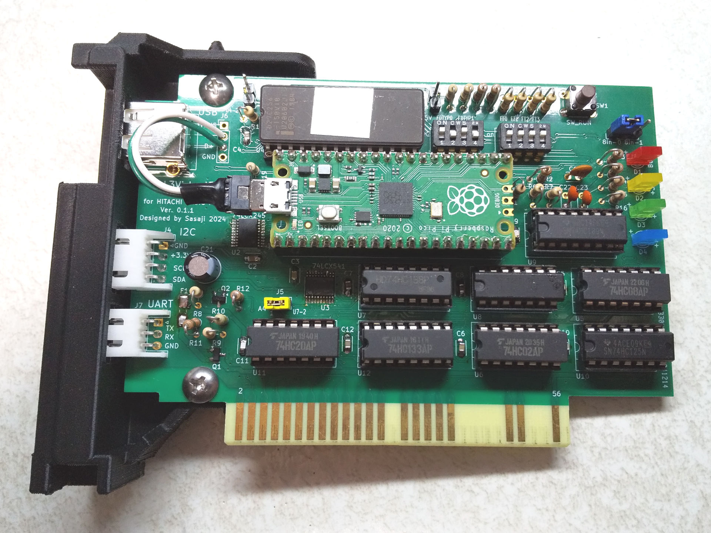
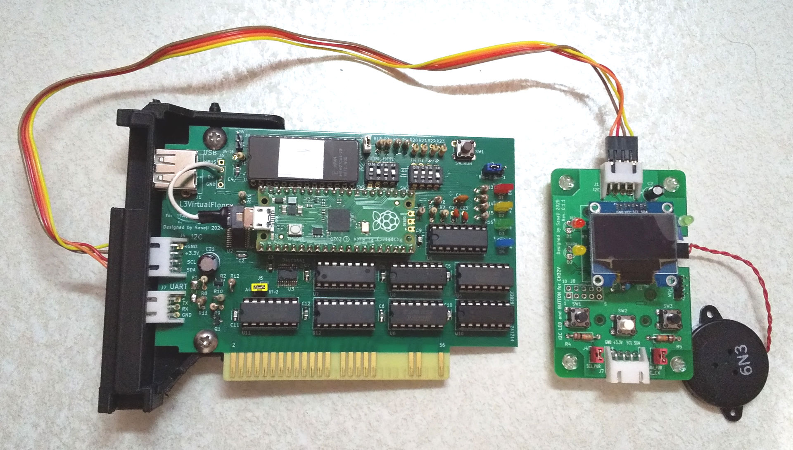
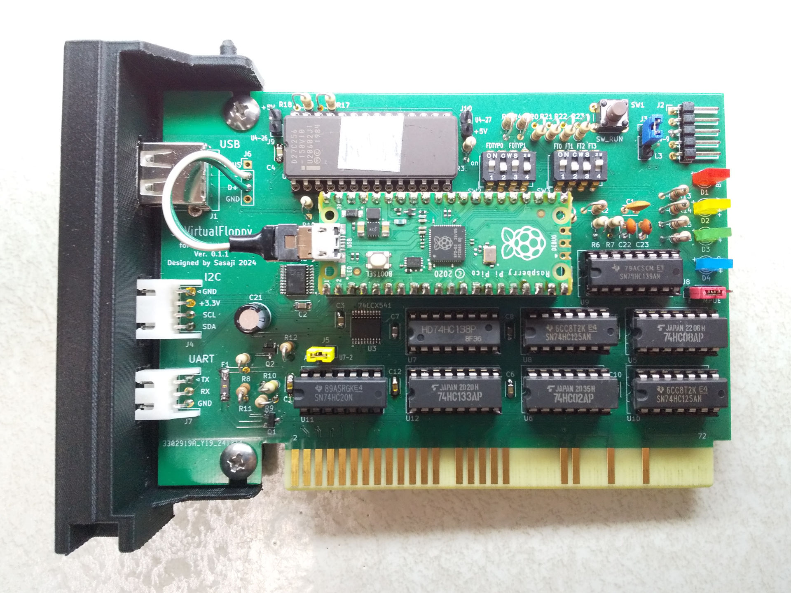
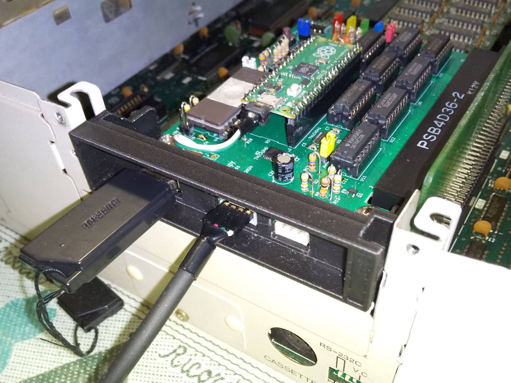
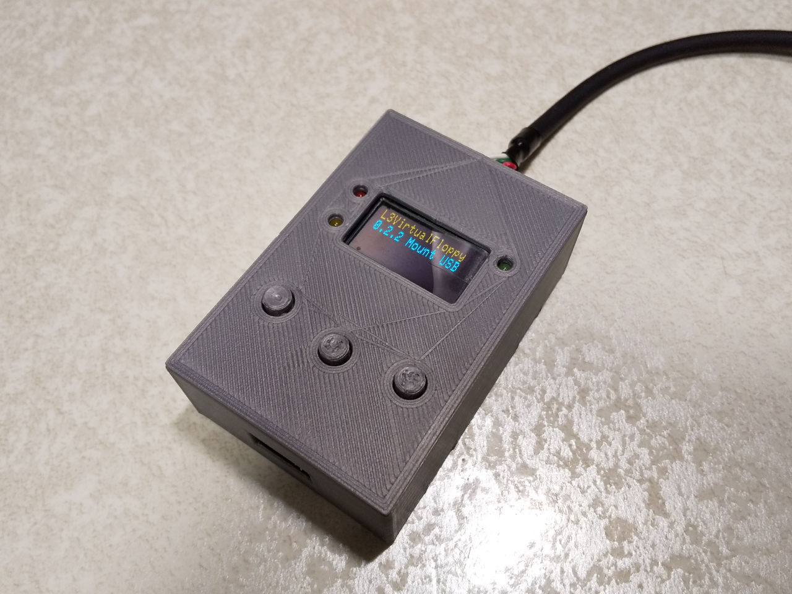

# バーチャルフロッピーカード for 日立ベーシックマスターレベル3 / MB-S1

## フォルダ構成

    3DModel/ ....................... 背面カバーの3Dモデル
      BML3/ .......................... 日立ベーシックマスターレベル3用の3Dモデル
      MBS1/ .......................... 日立MB-S1用の3Dモデル
    Board/ ......................... 基板設計
      BML3/ .......................... 日立ベーシックマスターレベル3用の基板設計
      MBS1/ .......................... 日立MB-S1用の基板設計
    Documents/ ..................... 説明書など
      BML3/ .......................... 日立ベーシックマスターレベル3用の説明書
      MBS1/ .......................... 日立MB-S1用の説明書
    Software/ ...................... ソフトウェア
      Controller/ .................... 本体カード用コントローラー
      Main/ .......................... 本体用(Pico SDK v2.0.0 + Visual Code(Cmake))
        pico_l3/ ....................... 日立ベーシックマスターレベル3用のソフトウェア
        pico_s1/ ....................... 日立MB-S1用のソフトウェア

-----
# Virtual Floppy Card for HITACHI Basic Master Level3 / MB-S1

## Folders

    3DModel/ ....................... The 3d models of back cover
      BML3/ .......................... for HITACHI Basic Master Level3
      MBS1/ .......................... for HITACHI MB-S1
    Board/ ......................... The circuit board design
      BML3/ .......................... for HITACHI Basic Master Level3
      MBS1/ .......................... for HITACHI MB-S1
    Documents/ ..................... Documents
      BML3/ .......................... for HITACHI Basic Master Level3
      MBS1/ .......................... for HITACHI MB-S1
    Software/ ...................... Software
      Controller/ .................... Controller for main card
      Main/ .......................... Main card (Pico SDK v2.0.0 + Visual Code(Cmake))
        pico_l3/ ....................... for HITACHI Basic Master Level3
        pico_s1/ ....................... for HITACHI MB-S1

-----
 MailTo: Sasaji (sasaji@s-sasaji.ddo.jp)
 * My Webpage: http://s-sasaji.ddo.jp/bml3mk5/
 * GitHub:     https://github.com/bml3mk5/L3S1VirtualFloppy
 * X(Twitter): https://x.com/bml3mk5
